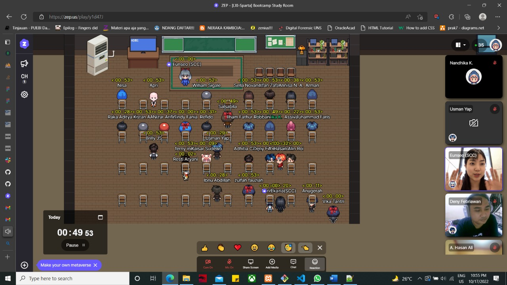

# My First Experience

So, today is my first experience using ZEP for online meeting. I think ZEP is fun to use as a learning medium. Very interactive and lots of features. And then, it's also my first time to meet my team during Week One. I hope I can enjoy the course.



```
The picture above is my documentation during the ZEP time in my day one. 
```

## Team Project Topic

Our first project related to a list of books we have read, we nemed it:
```kotlin
My Reading List
```

## What I have done
So far, talking about our first project has been hilarious. We decided to design it using Figma. One of us shared the screen then we exchanged opinions

## Goal
I hope I can enjoy every moment in this bootcamp.