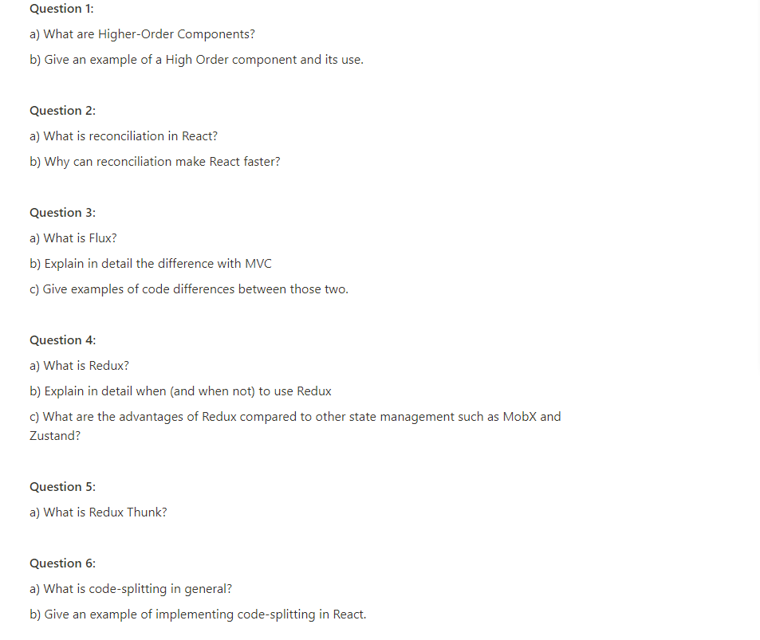

# Day 19

## Question


## Answer
1. The definition of High Order Components or we can call it HOC based on the official React website, HOC:
	a higher-order component is a function that takes a component and returns a new component.
	
	Or we can conclude that, if we have one component named A and anoter component named B, then we can create a new component named C by using a HOC.
	which contains A & B plus other DOM features & components / elements.
	
	For example:
	In week-3 we learned about React-Redux,  where if we want to create a component that can respond to updates in the Store & send an Action object,
	we can write code like this:
		import { connect } from 'react-redux';

		export const MyComponent = (props) => ( // ...dsb );

		//HOC
		export default connect()(MyComponent);

2. a. Reconciliation is the process through which React updates the DOM. When a component’s state changes, React has to calculate 
	if it is necessary to update the DOM. It does this by creating a virtual DOM and comparing it with the current DOM. 
	In this context, the virtual DOM will contain the new state of the component.
	
	b. Virtual DOM makes the performance faster, not because the processing itself is done in less time. The reason is the amount of changed 
	information – rather than wasting time on updating the entire page, you can dissect it to small elements and interactions. 
	
3. a. Flux is a programming concept where data is Uni-directional. This is where data enters an application and flows through 1 direction until it is rendered 
	on the screen.
	
	b. 
		- In Flux we will find there is a single controller with multiple models. This is not the way MVC principal speaks. In MVC, a controller has a single 
		model.
		- In the flux the data flow direction is Unidirectional. But in the MVC the data flow direction is Bidirectional.
	
	c. 
```
		import React,{useState} from 'react';
		import View from "./View";

		function Code(){
		const[toggle,setToggle]=useState(false);

		function handleClickTrue(){
			setToggle(true);
		}

		function handleClickFalse(){
			setToggle(false);
		}


		return(
			<div>
			{toggle&&<h1>Hello world</h1>}
			
		//Passing handleClickkTrue and handleCLickFalse functions as props to View.
			
			<View isTrue={handleClickTrue} isFalse={handleClickFalse}/>
			</div>
		);
		}

		export default Code
		
		import React from 'react';

		function View({isTrue,isFalse}){
		return(
			<div>

			<button onClick={isTrue}>Render Hello World</button>
			<button onClick={isFalse}>Remove Hello World </button>
			
			</div>
		);
		}

		export default View
```

4. a. Redux can be called as a global state.

	b. When we to use Redux:
		- We have a very large and complex app with multiple states that are needed in many places of the app
		- We have often refreshing states
		- We need to add complex logic whenever certain states are updated
		- The codebase is medium-sized or above and has many contributors
		
		When not to use Redux:
		- Top-level component props are only being passed down as far as their children
		- Our app doesn't require a lot of constantly refreshing data
		- Has no use for an authentication system, like checking if a user is authenticated/logged in
	
	c. In Redux state in the store is immutable, which means that all states are read-only. Actions in Redux can change the state, and reducers can 
	substitute the previous state with a new state. This is what makes Redux pure and predictable.

	In MobX, the state is mutable, which means you can easily update the state with new values
	making MobX impure and unpredictable.

5.  Redux Thunk is communicating asynchronously with external APIs to retrieve or store data. Redux Thunk makes it easy to send actions that follow the 
	lifecycle of requests to external APIs.
	
6. a. Code Splitting is a method that helps to generate bundles that are able to run dynamically. It also helps to make the code efficient because 
	the bundle contains all required imports and files.
	
	b. 
    import React, { useState } from 'react';
    import Loadable from 'react-loadable';
    import Loader from 'components/Loader';

    const SomeComponent = Loadable({
    loader: () => import('components/SomeComponent'),
    loading: Loading
    });

    const App = () => {
    const [showComponent, setShowComponent] = useState(false);

    return (
    if (showComponent) {
    return <SomeComponent />;
    } else {
    return (
    <>
    <h1>Hello word!</h1>
    <button onClick={() => setShowComponent(true)}>Click me!</button>
    </>
    );
    }
    );
    };

    export default App;