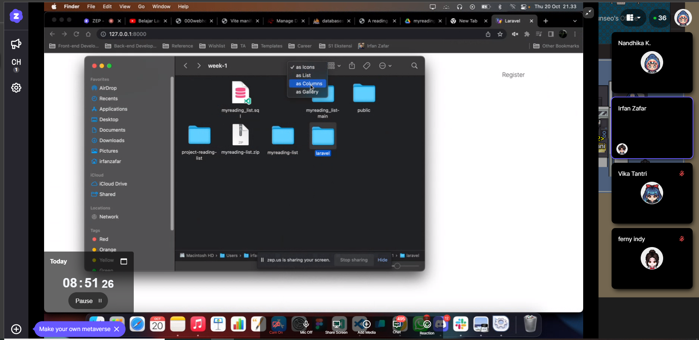
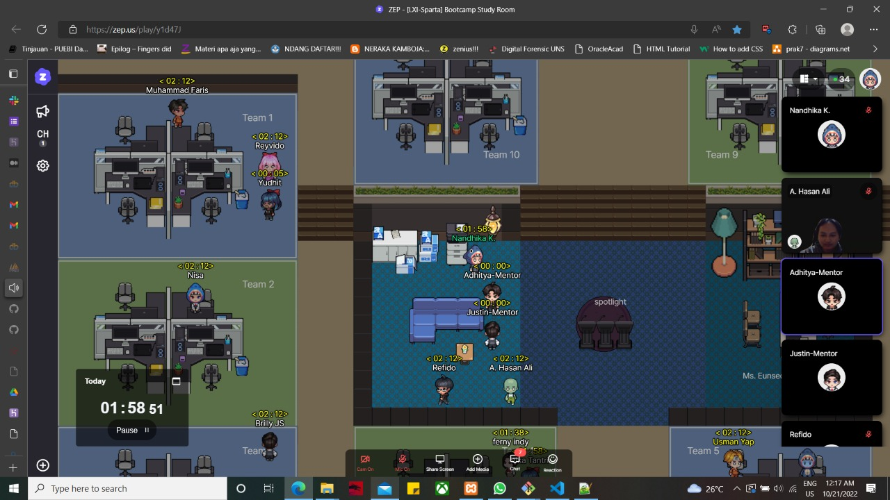

# Day Four
So, today we are completing our project and we had been deploying it to Heroku. 



```
The picture above is one part of our discussion. 
```

Big thanks to Mr. Adhit and Mr. Justin for helping a lot in resolving our problem when deploying our files to Heroku and until successfully running them on the server.



#  Team goal today
```
Completing the project.
```
# What I've Done
Deploying our website to Heroku.

All can be seen on this following link:
http://damp-hollows-19441.herokuapp.com/

And here is our code docummentations:
https://github.com/Nakakari/myreading_list.git

# Reflection
I must improve my communication skill in my team. .😥 and coding skill too.

# The plan for tomorrow
Meet Ms. Eunseo and tell her about my unconfidence when I must speak in English :v

#SpartaCodingClub #LXI-Sparta Bootcamp #Full-Stack #Coding