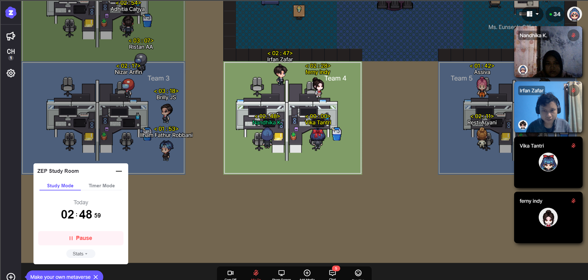
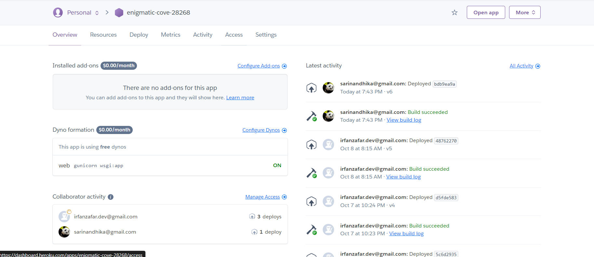

# My First Experience

So, today we are starting do our team project for this week. We've talked about how to manage project team eassily for four member.
Then, we decided to using heroku to make collaboration.



```
The picture above is my documentation during team discussion. 
```

# What I've Learned
Today I had been learning how to clone for other project in Heroku.
These are the procedure that I got to clone from Heroku:
1. Add Collabolator by adding their email

```
As you can see that there's my account and my teammate account as collabolator on enigmatic-cove-28268.
```
2. Open our gmail, then check our inbox. There will be a guide how to clone the repository.
```
$ heroku git:clone -a 'app-name'
```
3. Open cloned folder, then check to the main file which has .py extension. Then look, is there something odd there?
4. If there is, then start to install the required necessities. Such as:
```
python -m pip install requests bs4 certifi
```
You can adjust the needs depending on the needs of the project environment.
5. Then, 
```
running file which has .py extension in main area.
```
6. 
```
$ heroku open
```