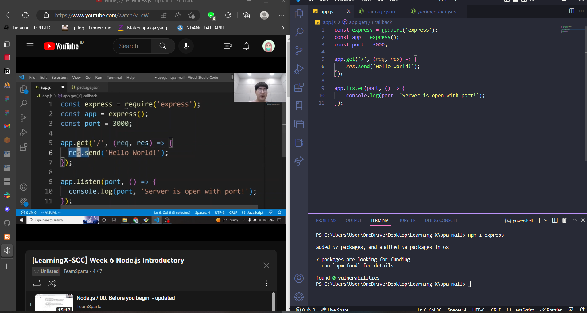

# Day 25

<aside>
🔑 Q5. **[Is Node.js a JavaScript runtime environment or an EcmaScript environment?](https://stackoverflow.com/questions/50296495/is-node-js-a-javascript-runtime-environment-or-an-ecmascript-environment)**

</aside>

The difference between JavaScript and ECMAScript is just a pedantic difference that most people don't really care about. Technically the official language name according to the standard is ECMAScript, but for historical and convenience reasons people almost always call it "JavaScript". I've never met anybody who calls themselves an "ECMAScript developer".

As far as I know, JavaScript doesn't even have an official formal definition. While ECMAScript has a prescriptive definition with versions that are formally defined by their various specifications, the meaning of "JavaScript" is essentially defined by how people use it.

For this reason, Node.js advertises itself as a JavaScript runtime. It might be more "technically correct" to call it an ECMAScript runtime, but it would be more confusing for most people to advertise it that way.

