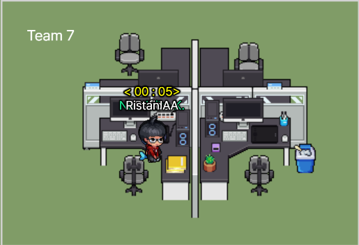

# LXI - SpartaCodingClub Full-Stack Bootcamp in Indonesia] 2022/11/02 TIL/Week 3

## What I Learn Today?

Well, I've completed my personal task. I feel more undersand about redux, and now I also understand how to make unique ID using a package. 

When mentoring time, Mr. Justing tought me abour rejection in Heroku. If we got rejected to push in our branch there are some solution:

```
Delete package-lock or yarn.lock.
Then downgrade our Heroku version.
```

## What did I do Well?

I had been enjoying to disscuss with members in my team. 
All can be seen in:

[](https://my-todo-02112022.herokuapp.com/)

## What Needs to Improve?

To know more about React basic components and rules.

## Documentation

