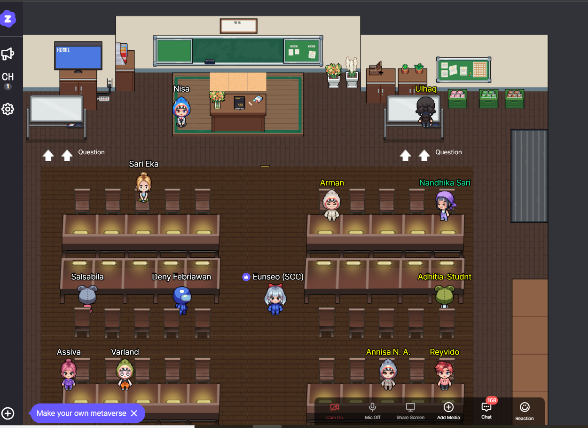
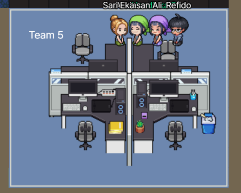

# Day Eight
Today I've completed the personal task.

So far, I've learned more about array-like object. First I was confuse about that. But now, I still getting confuse.

I've learned about if-else, hook, useState, how to call props from child to parent.

```react
    **In Parent**

    import Input from "./Input"

    const App = () => {

    // Memanggil data dari parent ke App
    function handleInput(name) {
        console.log('App dipanggil ', name)
    }

    // Memanggil data dari cildern ke parent

    function handleOnChange(value) {
        console.log('Halo', value)
    }

    return (
        <Input title="name" handleInput={handleInput} handleOnChange={handleOnChange} />
    )
    }

    export default App
```

```react
    **In Child**
    const Input = (props) => {
    // console.log(props)
    props.handleInput('alo') //Memanggil fungsi dari parent
    function handleOnChange(e) {
        console.log(e.target.value)
        props.handleOnChange(e.target.value)
    }
    return <>
        <label>{props.title}</label>
        <input onChange={handleOnChange} />
    </>
}

```

## What I've Done
    All can be seen in:
   
[](https://fierce-caverns-76682.herokuapp.com/)

## Summary
    In this week I got supper energic teammate. I love to talk to them, they were very responsive when I asked something about React.

### Documentation for today


```
    I took the picture above during the minitest
```



```
    I love to talk with them 🐾
```