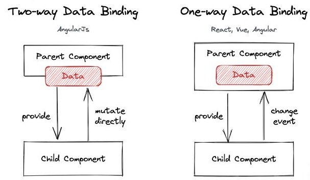

# Day Six
So, today we are completing team task. 

# Q1. What’s the differenece between array and array-like object in javascript. How can you change each element in an array-like object?
## Answer
    - The different between array and array-like object in JS can be seen below:
    - When the type of the elements are number, we can use array. But, if the elements have string type, we can use array-like object.
    - The data inside an array is known as Elements. But the data inside array-like object are known as properties which is consist a key and a value.
    - Both of iterating in array and array-like object is possible to use For..in, For..of, and ForEach(). But, we can use For loop in array, not in array-like object.

    For example:
        // Array of objects
        var myObject = {
            jhon: {
                name: 'jhon',
                age: 12,
                gender: 'male'
            },
            rita: {
                name: 'rita',
                age: 32,
                gender: 'male'
            }
        };

        //Array
        var myArr = [1, 2, 3, 4, 5];

    To change each element in an array-like object, we can use:
    - findIndex() method,
        const arr = [
        {id: 1, name: 'Alice'},
        {id: 2, name: 'Bob'},
        ]; //These are objects in an array

        const index = arr.findIndex(object => {
        return object.id === 2;
        }); // findIndex() is the way to get the index of the specific object.

        if (index !== -1) {
        arr[index].name = 'John'; 
        //Access the array at the index and change the  property's value using dot notation.
        } 

        // 👇️ [{id: 1, name: 'Alice'}, {id: 2, name: 'John'}]
        console.log(arr);
    - Array.map() method, 
        const arr = [
        {id: 1, name: 'Alice'},
        {id: 2, name: 'Bob'},
        ];

        const newArr = arr.map(object => {
        if (object.id === 2) {
            //  change value of name property
            return {...object, name: 'John'};
        }
        return object;
        });

        // 👇️ [{id: 1, name: 'Alice'}, {id: 2, name: 'John'}]
        console.log(newArr);

        // 👇️ [{id: 1, name: 'Alice'}, {id: 2, name: 'Bob'}]
        console.log(arr);
    
# Q2 There are parent component A and child component B. Component A has {name: “Sparta"} as its state and pass down the name value to  component B. Then, component B shows the name value on the screen. Please draw the lifecycle of how the value is shown on the screen when component A’s state is changed to {name: "LearningX"}.
## Answer
    const A = () => {
		//Here is parent component
		const  a = {name: “Sparta”}
  		return 

  		  <Child name={a}/>
 		 
;
    }

    const B = (props) => {
        //Here is child component
        const b = {name: “LearningX”} 
        Return 

            {b.name}
    

    }

# Q3. What is two-way binding? Explain What is two-way binding? Explain how the re-rendering is done when using two-way binding. (Assume that there are parent component A and child component B.). (Assume that there are parent component A and child component B.)
## Answer

    In one-way binding, the flow is one-directional. This means that the flow of code is from the ts file to the Html file.

    In two-way binding, the flow is two-directional.  This means that the flow of code is from the ts file to the Html file and from the Html file to the ts file.

# Q4. Event listener should be removed when it’s called out. When component is disappered(=unmount) from the screen in class component, event listener is removed in componentWillUnmount. Then, how do you remove event listener in functional component where you can’t use the lifecycle method?
## Answer
    
# Q5. We usually use ref to approach to DOM in react. Why do we use ref instead of document.getElementsByClassName?
## Answer
    In general, refs are preferable to documents. getElementById, because it is more consistent with the rest of the react code.

    Every component class in react can have multiple component instances.

    Using id is risky because react does not prevent you from having multiple forms on a single page, and the DOM then contains multiple inputs with the same ID. That is not permitted.

    Another advantage of using refs is that they are only accessible in the context in which they are defined. If we need to access information outside of this context, we must use props and state (and possibly stores).
    And this is a benefit because there is less/no chance of breaking our unidirectional data flow, which would make our code more difficult to manage.

# Q6. Explain SPA and MPA.
## Answer
    - A single-page application (SPA) is a web-based application that uses only one web page to display the application. All clicks or data presentations do not reload the entire page, but only a few are updated from the server or from the client-side application process results. Because of the use of this technology, the web created is lighter and faster to use.
    - A Multi-page Application (MPA) is a web application made up of a large number of pages that are completely refreshed whenever data on them changes. Any change or transfer of data to the server results in a new page being displayed in the browser. It is the polar opposite of a single page application, which has only one page and dynamically updates data without changing the page.

# Q7. Why there’s an error when you move to the page like spartacodingclub.com/login instead of spartacodingclub.com after deploying to s3 bucket?
# Answer

# DIY
[Our DIY](../weektwo/diy.md)